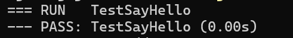
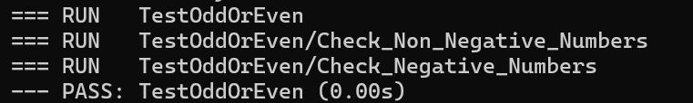
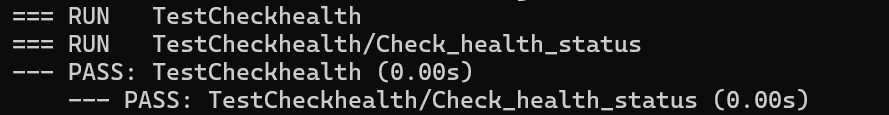

# Ponderada de Programação (Semana 1) - TDD com Golang

## Introdução ao TDD (Test-Driven Development)

O Desenvolvimento Orientado por Testes (TDD) é uma abordagem de desenvolvimento de software onde os testes são escritos antes da implementação do código. O ciclo do TDD é composto por três etapas principais: Red, Green e Refactor.

## Ciclo TDD

1. **Red (Falha)**
   - **Escrever um teste que falhe**: Antes de implementar uma nova funcionalidade, escrevemos um teste que descreve o comportamento esperado. Como a funcionalidade ainda não está implementada, o teste deve falhar.
   - **Exemplo**:
     - Escrevemos testes como `TestSayHello`, `TestOddOrEven` e `TestCheckhealth`, que inicialmente falham porque as funções `SayHello`, `OddOrEven` e `Checkhealth` ainda não foram implementadas.

2. **Green (Sucesso)**
   - **Implementar o código para passar no teste**: Escrevemos o código mínimo necessário para passar no teste. O objetivo é fazer com que o teste passe, sem se preocupar com a qualidade ou eficiência do código.
   - **Exemplo**:
     - Implementamos as funções `SayHello`, `OddOrEven` e `Checkhealth` para que os testes correspondentes passem. 

3. **Refactor (Refatoração)**
   - **Refatoramento do código**: Melhoramos a qualidade do código, mantendo todos os testes passando para garantir que a funcionalidade não foi quebrada. A refatoração pode envolver melhorias na estrutura, legibilidade e eficiência do código.
   - **Exemplo**:
     - Após garantir que os testes passem, podemos melhorar a estrutura ou a eficiência das funções `SayHello`, `OddOrEven` e `Checkhealth`, mantendo todos os testes em funcionamento.

## Benefícios do TDD

- **Maior Confiança no Código**: Testes são escritos para cobrir todos os casos de uso esperados, resultando em menos bugs e regressões.
- **Design de Código Melhorado**: O TDD encoraja a escrita de código modular e desacoplado, que é mais fácil de testar e manter.
- **Documentação Viva**: Os testes atuam como documentação executável, descrevendo exatamente como o sistema deve se comportar.
- **Feedback Rápido**: Testes automatizados fornecem feedback imediato sobre o impacto das mudanças no código.

## Documentação da execução dos testes 

### TestSayHello

```go
func TestSayHello(t *testing.T) {
    // Red: Inicialmente escrevemos este teste, que falha porque a função SayHello ainda não foi implementada.
    // Green: Implementamos a função SayHello para que o teste passe.
    // Refactor: Melhoramos o código conforme necessário, mantendo todos os testes passando.
    greeting := starter.SayHello("Yago")
    assert.Equal(t, "Hello Yago. Welcome!", greeting)
    
    another_greeting := starter.SayHello("Romualdo")
    assert.Equal(t, "Hello Romualdo. Welcome!", another_greeting)
}

```

### Execução do Teste



### TestOddOrEven
```go
// TestOddOrEven testa a função OddOrEven.
// Este teste verifica se o número fornecido é corretamente identificado como ímpar ou par.
// Utilizamos subtestes para organizar os casos de teste para números não negativos e negativos.
func TestOddOrEven(t *testing.T) {
	t.Run("Check Non Negative Numbers", func(t *testing.T) {
		// Testando números não negativos
		assert.Equal(t, "45 is an odd number", starter.OddOrEven(45))
		assert.Equal(t, "42 is an even number", starter.OddOrEven(42))
		assert.Equal(t, "0 is an even number", starter.OddOrEven(0))
	})

	t.Run("Check Negative Numbers", func(t *testing.T) {
		// Testando números negativos
		assert.Equal(t, "-45 is an odd number", starter.OddOrEven(-45))
		assert.Equal(t, "-42 is an even number", starter.OddOrEven(-42))
	})
}
```
### Execução do Teste




### TestCheckhealth
```go
// TestCheckhealth testa a função Checkhealth.
// Este teste verifica se a resposta da verificação de saúde está formatada corretamente e contém os valores esperados.
func TestCheckhealth(t *testing.T) {
	t.Run("Check health status", func(t *testing.T) {
		// Criando uma requisição HTTP simulada
		req := httptest.NewRequest("GET", "http://google.com", nil)
		// Criando um gravador de resposta HTTP simulado
		writer := httptest.NewRecorder()
		// Chamando a função Checkhealth com a requisição e o gravador
		starter.Checkhealth(writer, req)
		// Obtendo a resposta gerada
		response := writer.Result()
		// Lendo o corpo da resposta
		body, err := io.ReadAll(response.Body)

		// Verificando se a mensagem de verificação de saúde está correta
		assert.Equal(t, "health check passed", string(body))
		// Verificando se o status da resposta é 200
		assert.Equal(t, 200, response.StatusCode)
		// Verificando se o cabeçalho Content-Type está correto
		assert.Equal(t, "text/plain; charset=utf-8", response.Header.Get("Content-Type"))
		// Verificando se não houve erros ao ler o corpo da resposta
		assert.Nil(t, err)
	})
}

```



